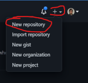
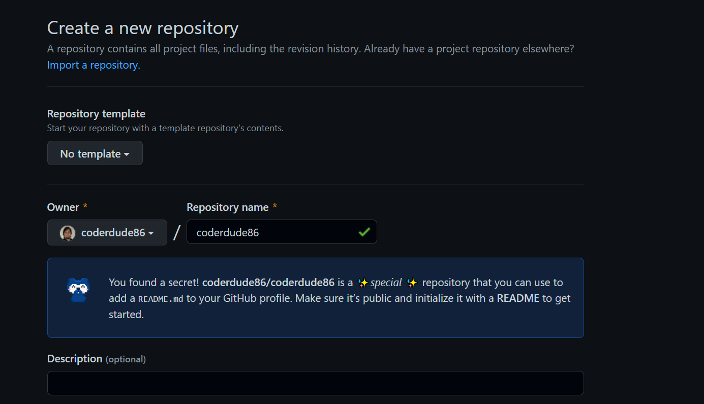

# How-to create a Profile Page

## Steps:

 1. In the upper-right corner of any page, use the + drop-down menu, and select New repository.

2. Under "Repository name" type a repository name that matches your GitHub username. For example, if your username is "coderdude86", the repository name must be "coderdude86". (A box will pop up saying you found a secret!).

3. Optionally, you can add a description of your repository. For example, "My personal repository."
4. Make the repository public.
5. Initialize the repository with a README.
6. Click the Create Repository button.
7. On the right side of the page, above the right sidebar, click Edit README.
8. Create markdown/HTML to be displayed on your profile page! It is pre-populated with some ideas on what to add inside a `comment`.
---

### Tips for your GitHub Profile README:
1. Keep it **simple**!
2. Start with a nice-looking header image.
3. Write a short intro about yourself.
4. Mention your tech stack and skills.
5. Include stats and language cards.

<!-- https://github.com/anuraghazra/github-readme-stats -->

---
### Links:
 - [Github Markdown CheatSheet](https://dev.to/sameerkatija/github-markdown-cheat-sheet-everything-you-need-to-know-to-write-readme-md-2eca)

---

___

