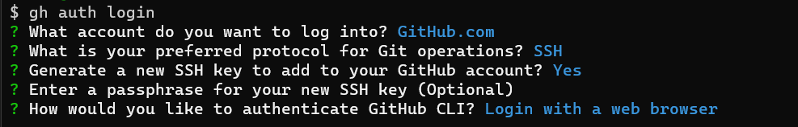

# How-to create and add your SSH keys for GitHub with the Git Hub CLI
   This guide will assist you in setting up your SSH Keys to be able to use `git` on the command line to get and backup your work.

---
## Requirements
- [GitHub.com](https://github.com) account created
- access to your terminal of choice
    - *MacOS* 
      - terminal comes with macOS
      - `homebrew` should be installed
    - *Windows* 
      - [GitBash](https://git-scm.com/download/win) should be installed.
---
## :one: Installing the GitHub Command-line tools

### Mac OS
  1. Open your terminal 
     - `⌘ + space` and type `terminal`
  2. type `brew install gh`
  3. now your ready for the next step

### Windows
  1. Download and Install GitHub CLI tools
     - [GitHub CLI website](https://cli.github.com/) 
        -  this page should have a big blue button you can click on.
     - [Direct Link GitHub CLI Download](https://github.com/cli/cli/releases/download/v2.2.0/gh_2.2.0_windows_amd64.msi)
  2. Once this is installed if you have GitBash open close it. 

---
## :two: Authenticating with the GitHub cli tools
  1. open your terminal (terminal or GitBash) 
  2. type ```gh auth login``` and press `ENTER`
  
  3. During this next step, it will ask you to login to GitHub.com in your web browser, follow your browser, when its completed there, come back to the terminal, and will ask you to create a key, just hit `ENTER` and follow the prompts, when it's finished it should say you are `Logged in as username` with username being your username. 
  

---
