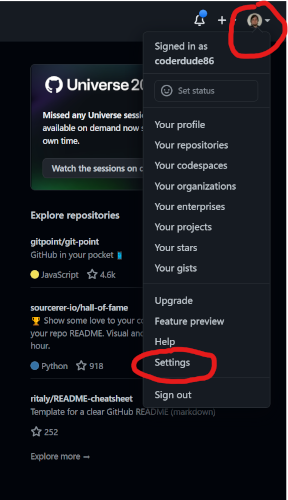
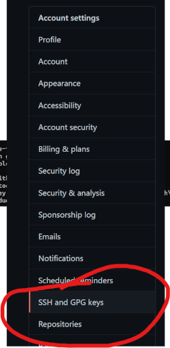

# How-to create and add your SSH keys for GitHub
   This guide will assist you in setting up your SSH Keys to be able to use `git` on the command line to get and backup your work.


## Requirements
- [GitHub.com](https://github.com) account created
- access to your terminal of choice
    - *MacOS* - terminal should be installed
    - *Windows* - [GitBash](https://git-scm.com/download/win) should be installed.
    - *Ubuntu / Linux* - any terminal emulator you have installed.

---
> ### :point_right: ***Please note:*** any time I reference `terminal` for Windows that will be GitBash. 
---
## :one: Creating the key
 - You will type in the following command, you will need to change the email address to your email address used with GitHub.
```bash
ssh-keygen -t ed25519 -C "your_email@example.com"
```
 - after you enter in that command it's going to ask for some information.
    - Where to place the files. *Hit* **`ENTER`** *here*
    - a passphrase 
      - This is a extra layer of security, you can press **`ENTER`** here if you do not want one.
    - you will enter in your passhrase a second time, if you hit enter before just hit enter agian.
---
## :two: copying the key
Depending on which OS you have, copy the key to your clipboard with the respective commands. 
> No news is good news. 
- **Windows**
```bash
clip < ~/.ssh/id_ed25519.pub
```
- **Mac**
```bash
pbcopy < ~/.ssh/id_ed25519.pub
```
---
## :three: putting the key into GitHub
- Login to [GitHub](https://github.com). and go to the upper right corner and click on your picture, and almost at the bottom of that menu will be an option that says Settings.
   - 
- On the Left side, look for the option that says `SSH and GPG Keys` or you can click the following link
  - [GitHub SSH Key Settings](https://github.com/settings/keys)
    - 
-

---
## :four: Testing out the key
- Now we will try and make a connection to github with the SSH protocol. 
- switch back to your terminal and type in the following command. 
```bash
ssh -T git@github.com
```
- if sucessfull you should see a message like the following
```
Hi coderdude86! You've successfully authenticated, but GitHub does not provide shell access.
```
---